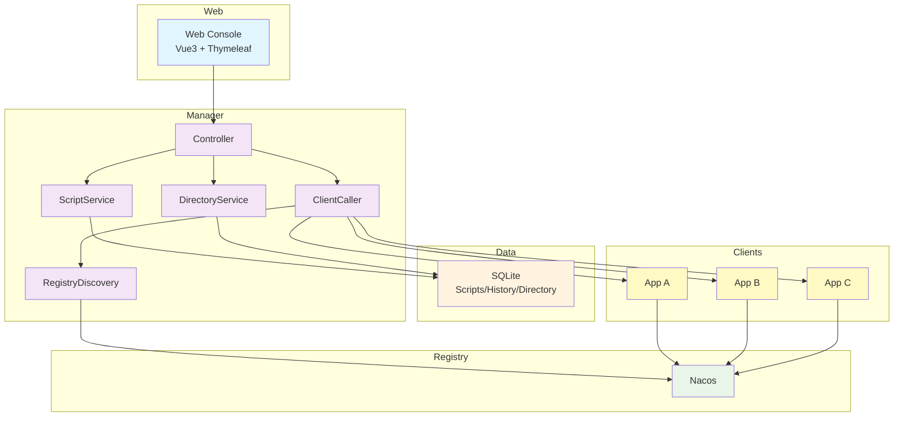
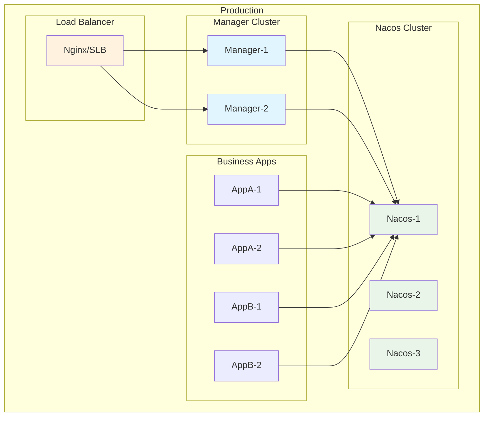

<div align="center">
  <h1>🔧 Maintain Console</h1>
  <p><strong>Remote Groovy Script Execution & Operations Console</strong></p>


<p>
  Language:
  <strong>English</strong> | <a href="./README.md">简体中文</a>
</p>
</div>

## 📖 Overview

Maintain Console is an operations platform designed for enterprise-grade distributed systems. It enables real-time
remote script execution across multiple microservices from a unified web console—without redeploying applications. Built
on Spring Boot and Spring Cloud, it provides a secure, efficient, and easy-to-use automation solution.

### ✨ Key Features

- 🎯 Unified Control: Manage all distributed apps from a single console
- 🚀 Script Execution: Execute Groovy scripts and general commands remotely
- 🔒 Security: RSA digital signature for secure communication
- 📊 Visual Console: Intuitive web UI boosts ops efficiency
- 🌐 Service Discovery: Nacos-based discovery and load balancing
- 📝 Auditability: Full execution history and audit trail
- 🔧 Pluggable Architecture: SPI-based extensibility
- 💾 Lightweight: Built-in SQLite for quick start

### 🎯 Use Cases

- Microservices operations and unified management
- Batch script automation to improve efficiency
- Remote system inspection and diagnostics
- Safe database maintenance and data processing
- Rapid incident response and hotfix execution

### UI Samples


## 🚀 Quick Start

### Requirements

- JDK: 1.8+
- Maven: 3.6+
- Nacos: 1.4.0+ (optional for production)

### 1. Clone

```bash
git clone https://github.com/chenyilei2016/maintain-console-public.git
cd maintain-console-public
```

### 2. Build

```bash
mvn clean install -DskipTests
```

### 3. Start Manager

#### 3.1 Local Dev (mock registry + SQLite)

Database:

- The local profile automatically creates SQLite DB file:
    - manager/src/main/resources/sqlite/maintain-manager.sqlite
- Start directly with no external dependencies

```bash
cd manager
mvn spring-boot:run -Dspring-boot.run.profiles=local
```

#### 3.2 Production (Nacos + MySQL)

Database:

- Create MySQL tables via: docs/directory_management.sql

Config:

- bootstrap-prod.properties
    - If using Nacos as config center, set spring.cloud.nacos.config.server-addr
    - If not using Nacos config center, you can remove bootstrap-prod.properties
- application-prod.properties
    - Set production DB configs:
        - spring.datasource.url
        - spring.datasource.username
        - spring.datasource.password

Auth Context:

- Default login context reads user info from the current context; customize per your org as needed:
    - io.github.chenyilei2016.maintain.manager.context.LoginUserContext

Start:

```bash
cd manager
mvn spring-boot:run -Dspring-boot.run.profiles=prod
```

### 4. Access Console

- Default port: 9999
- Open: http://localhost:9999

### 5. Integrate Client

Add dependencies to your application:

```xml
<!-- HTTP communication -->
<dependency>
    <groupId>io.github.chenyilei2016</groupId>
    <artifactId>maintain-console-client-http-starter</artifactId>
    <version>1.0-SNAPSHOT</version>
</dependency>

        <!-- Service registry support -->
<dependency>
<groupId>io.github.chenyilei2016</groupId>
<artifactId>maintain-console-client-registry-starter</artifactId>
<version>1.0-SNAPSHOT</version>
</dependency>

        <!-- Groovy script execution support -->
<dependency>
<groupId>io.github.chenyilei2016</groupId>
<artifactId>maintain-console-client-groovy-support-starter</artifactId>
<version>1.0-SNAPSHOT</version>
</dependency>
```

Enable in application config:

```properties
# Enable maintain console client
maintain.console.enabled=true
# Nacos discovery (production)
spring.cloud.nacos.discovery.server-addr=127.0.0.1:8848
```

## 🏗️ Project Structure

```
maintain-console/
├── manager/
│   ├── src/main/java/
│   │   └── io/github/chenyilei2016/maintain/manager/
│   │       ├── controller/          # Web controllers
│   │       ├── service/             # Services
│   │       ├── pojo/
│   │       │   ├── dataobject/      # Data objects
│   │       │   ├── entity/          # Domain entities
│   │       │   ├── mapper/          # MyBatis Mapper
│   │       │   └── repository/      # Repositories
│   │       ├── context/             # Contexts
│   │       └── enums/               # Enums
│   ├── src/main/resources/
│   │   ├── static/
│   │   ├── templates/               # Thymeleaf
│   │   ├── sqlite/                  # SQLite DB
│   │   └── mapper/                  # MyBatis XML
│   └── pom.xml
├── maintain-console-client/
│   ├── maintain-console-client-common/
│   ├── maintain-console-client-registry-starter/
│   ├── maintain-console-client-http-starter/
│   └── maintain-console-client-groovy-support-starter/
├── groovy-sample/
├── sample-projects/
└── pom.xml
```

## 🔐 Security

### RSA Digital Signature

To secure Manager-Client communication:

1. Keypair generation: Manager generates an RSA keypair at startup
2. Request signing: Each API request includes a timestamp and signature
3. Signature verification: Client verifies the signature
4. Anti-replay: Timestamp-based validity window

### API Flow (Example)

```java
// Manager side
public class ClientCaller {
    public String invokeScript(String clientName, ScriptRequest request) {
        request.setTimestamp(System.currentTimeMillis());
        String signature = rsaSignUtil.sign(request.toSignString());
        request.setSignature(signature);
        return clientApi.invokeScript(clientName, request);
    }
}

// Client side
@PostMapping("/invoke-script")
public ResponseEntity<String> invokeScript(@RequestBody ScriptRequest request) {
    if (!isValidTimestamp(request.getTimestamp())) {
        return ResponseEntity.badRequest().body("Invalid timestamp");
    }
    if (!rsaSignUtil.verify(request.toSignString(), request.getSignature())) {
        return ResponseEntity.badRequest().body("Invalid signature");
    }
    String result = scriptExecutor.execute(request.getScript());
    return ResponseEntity.ok(result);
}
```

## 🚀 Performance

### Load Balancing

- Nacos-based service discovery
- Spring Cloud LoadBalancer (round-robin)
- Health checks
- Failover: exclude unhealthy instances automatically

### Connection Pool

```properties
# HTTP pool config bean name
io.github.chenyilei2016.maintain.manager.caller.http.RetrofitHttpProxyFactory.commonDefaultClient
```

### Script Execution

- Async execution for long-running scripts
- Timeout control
- Resource limits (CPU/memory)
- Isolation per execution context

### Architecture Diagram



### Tech Stack

- Backend: Spring Boot 2.3.12, Spring Cloud Hoxton.SR12
- Databases: SQLite (embedded), MySQL
- ORM: MyBatis-Plus
- Service Discovery: Nacos
- Frontend: HTML, Thymeleaf
- Protocols: HTTP, Retrofit2
- Scripting: Groovy
- Security: RSA digital signature

### Modules

1) Manager

- REST APIs and pages
- Script management, directory management, execution history
- Persistence via MyBatis-Plus
- Client invoker abstraction

2) Client SDK

- Common API & DTOs
- Registry Starter
- HTTP Starter
- Groovy Support Starter

3) Communication

- Nacos discovery
- Spring Cloud LoadBalancer
- RSA signature verification
- HTTP REST APIs

## Deployment

### Requirements

- JDK: 1.8
- DB: SQLite (built-in), MySQL
- Registry: Nacos 1.4.0+
- Memory: Manager 512MB+, Client 256MB+

### Topology



## 🐛 Troubleshooting

### 1) Manager fails to start (DB)

- Verify SQLite file path
- Ensure read/write permission
- Verify spring.datasource.url

```bash
ls -la manager/src/main/resources/sqlite/
chmod 664 manager/src/main/resources/sqlite/maintain-manager.sqlite
```

### 2) Client not visible in Manager

- Ensure Nacos is running
- Check Nacos address in client config
- Verify network/firewall

```properties
spring.cloud.nacos.discovery.server-addr=127.0.0.1:8848
maintain.console.enabled=true
```

### 3) Groovy script execution fails

- Validate script syntax
- Ensure referenced classes/methods exist
- Check execution history for details

### 4) RSA signature verification failed

- Check time synchronization between client and manager
- Ensure RSA public key is correct
- Consider network latency and timestamp validity window

### Logging

```properties
# Enable debug logs
logging.level.io.github.chenyilei2016=DEBUG
logging.level.org.springframework.cloud=DEBUG
logging.level.com.alibaba.nacos=DEBUG
# For file output, configure logback
```

## 🤝 Contributing

### Dev Setup

1) Fork

```bash
git clone https://github.com/your-username/maintain-console-public.git
cd maintain-console-public
```

2) Branch

```bash
git checkout -b feature/your-feature-name
```

3) Build

```bash
mvn clean install
```

4) Test

```bash
mvn test
```

### Code Style

- Follow Alibaba Java Style Guide
- Javadoc for important classes/methods
- Meaningful names
- Add unit tests for new features

### Conventional Commits

```bash
feat: add new feature
fix: bug fix
docs: documentation updates
style: code style only
refactor: refactoring
test: add/update tests
chore: build or tooling changes
```

### PR Flow

1. All tests pass
2. Update docs
3. Open PR to main
4. Address review feedback

## 📞 Community

- GitHub Issues: https://github.com/chenyilei2016/maintain-console-public/issues
- Discussions: https://github.com/chenyilei2016/maintain-console-public/discussions
- Wiki: https://github.com/chenyilei2016/maintain-console-public/wiki

## 📄 License

Released under the [Apache License 2.0](LICENSE).

```
Copyright 2024 chenyilei2016

Licensed under the Apache License, Version 2.0 (the "License");
you may not use this file except in compliance with the License.
You may obtain a copy of the License at

    http://www.apache.org/licenses/LICENSE-2.0

Unless required by applicable law or agreed to in writing, software
distributed under the License is distributed on an "AS IS" BASIS,
WITHOUT WARRANTIES OR CONDITIONS OF ANY KIND, either express or implied.
See the License for the specific language governing permissions and
limitations under the License.
```

## ⭐ Star History

[](https://star-history.com/#chenyilei2016/maintain-console-public&Date)

---

<div style="text-align:center">
  <p>If you find this project useful, please give it a ⭐</p>
  <p>Made with ❤️ by <a href="https://github.com/chenyilei2016">chenyilei2016</a></p>
</div>

---

## 📝 Roadmap

```
1. Record target machine details (e.g., IP) in execution history
2. Return a traceId for execution records to integrate with distributed tracing
3. Configurable report formats (e.g., map/Excel-like views)
4. Authoring improvements for easier script writing
```
