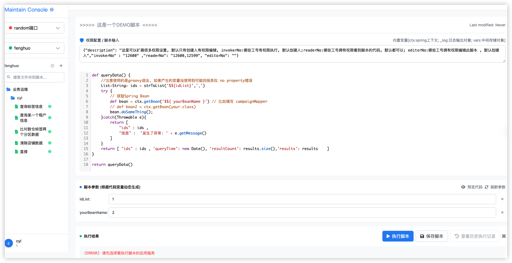
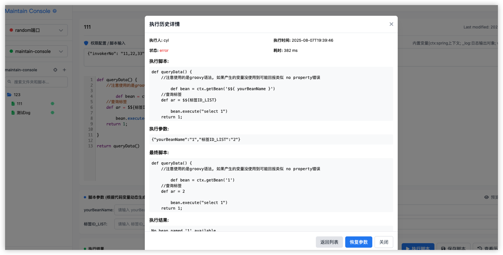
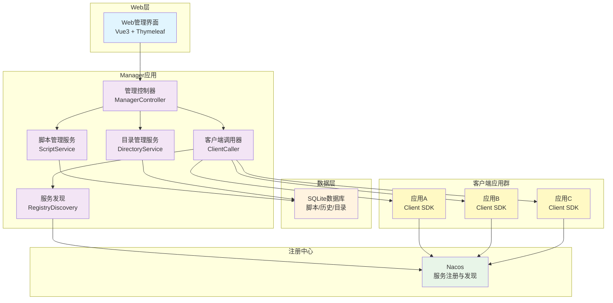

<div align="center">
  <h1>🔧 Maintain Console</h1>
  <p><strong>Groovy代码远程执行管理平台</strong></p>


</div>

## 📖 项目简介

Maintain Console 是一个专为企业级分布式系统设计的运维管理平台，通过统一的Web控制台实现对多个微服务应用的远程实时脚本执行,不需要重新发布代码。该平台基于Spring
Boot和Spring Cloud构建，提供了安全、高效、易用的运维自动化解决方案。

### ✨ 核心特性

- 🎯 **统一管理**: 通过单一控制台管理所有分布式应用
- 🚀 **脚本执行**: 支持Groovy脚本和通用命令的远程执行
- 🔒 **安全保障**: RSA数字签名确保通信安全
- 📊 **可视化操作**: 直观的Web界面提升运维效率
- 🌐 **服务发现**: 基于Nacos的自动服务发现和负载均衡
- 📝 **执行记录**: 完整的操作历史和审计追踪
- 🔧 **插件化架构**: 基于SPI的可扩展设计
- 💾 **轻量化部署**: 支持SQLite嵌入式数据库

### 🎯 适用场景

- **微服务运维**: 对多个微服务应用进行统一运维管理
- **脚本自动化**: 批量执行运维脚本，提升工作效率
- **系统监控**: 远程执行监控命令，实时了解系统状态
- **数据操作**: 安全执行数据库维护和数据处理任务
- **应急响应**: 快速响应系统问题，执行修复脚本

### 页面功能案例




## 🚀 快速开始

### 环境要求

- **JDK**: 1.8+
- **Maven**: 3.6+
- **Nacos**: 1.4.0+ (可选，用于生产环境)

### 1. 克隆项目

```bash
git clone https://github.com/chenyilei2016/maintain-console-public.git
cd maintain-console-public
```

### 2. 编译项目

```bash
mvn clean install -DskipTests
```

### 3. 启动Manager应用

#### 3.1 本地开发模式 (mock注册中心 + SQLite)

##### 数据库配置

> 创建SQLite 数据库表: docs/directory_management_sqlite.sql

```bash
cd manager
mvn spring-boot:run -Dspring-boot.run.profiles=local
```

#### 3.2 生产模式 (Nacos + MySQL)

##### 数据库配置

> 创建Mysql数据库表 : docs/directory_management.sql

##### 配置文件修改

> bootstrap-prod.properties
> * 如果使用Nacos作为配置中心，需要修改为Nacos的地址: spring.cloud.nacos.config.server-addr,
    不需要则将bootstrap-prod.properties删除即可

> application-prod.properties
> 补全以下生产数据库配置
> * spring.datasource.url
> * spring.datasource.username
> * spring.datasource.password

##### 登录态修改

```
 目前默认登录获取用户信息的方式为从上下文中获取, 可根据企业需求自行调整接入以下
 io.github.chenyilei2016.maintain.manager.context.LoginUserContext 
```

##### 启动命令
```bash
cd manager
mvn spring-boot:run -Dspring-boot.run.profiles=prod
```

### 4. 访问管理界面

manager默认tomcat端口9999
打开浏览器访问: http://localhost:9999

### 5. 客户端接入

在需要接入的应用中添加以下依赖：

```xml
<!-- HTTP通信支持 -->
<dependency>
    <groupId>io.github.chenyilei2016</groupId>
    <artifactId>maintain-console-client-http-starter</artifactId>
    <version>1.0-SNAPSHOT</version>
</dependency>

        <!-- 服务注册支持 -->
<dependency>
<groupId>io.github.chenyilei2016</groupId>
<artifactId>maintain-console-client-registry-starter</artifactId>
<version>1.0-SNAPSHOT</version>
</dependency>

        <!-- Groovy脚本执行支持 -->
<dependency>
<groupId>io.github.chenyilei2016</groupId>
<artifactId>maintain-console-client-groovy-support-starter</artifactId>
<version>1.0-SNAPSHOT</version>
</dependency>
```

在应用配置文件中启用客户端：

```properties
# 启用maintain console客户端
maintain.console.enabled=true
# Nacos服务发现配置（生产环境）
spring.cloud.nacos.discovery.server-addr=127.0.0.1:8848
```


## 🏗️ 项目结构

```

maintain-console/
├── manager/ # 管理端应用
│ ├── src/main/java/
│ │ └── io/github/chenyilei2016/maintain/manager/
│ │ ├── controller/ # Web控制器
│ │ ├── service/ # 业务服务
│ │ ├── pojo/
│ │ │ ├── dataobject/ # 数据对象
│ │ │ ├── entity/ # 业务实体
│ │ │ ├── mapper/ # MyBatis Mapper
│ │ │ └── repository/ # 数据仓库
│ │ ├── context/ # 上下文
│ │ └── enums/ # 枚举类
│ ├── src/main/resources/
│ │ ├── static/ # 静态资源
│ │ ├── templates/ # Thymeleaf模板
│ │ ├── sqlite/ # SQLite数据库
│ │ └── mapper/ # MyBatis XML
│ └── pom.xml
├── maintain-console-client/ # 客户端SDK
│ ├── maintain-console-client-common/ # 公共API
│ ├── maintain-console-client-registry-starter/ # 服务注册
│ ├── maintain-console-client-http-starter/ # HTTP通信
│ └── maintain-console-client-groovy-support-starter/ # Groovy支持
├── groovy-sample/ # Groovy示例
├── sample-projects/ # 示例项目
└── pom.xml
```

## 🔐 安全机制

### RSA数字签名

为确保Manager和Client之间的通信安全，系统采用RSA数字签名机制：

1. **密钥对生成**：Manager启动时自动生成RSA密钥对
2. **请求签名**：每个API请求都包含时间戳和签名信息
3. **签名验证**：Client收到请求后验证签名的有效性
4. **防重放攻击**：基于时间戳的请求有效期限制

### API调用流程

```java
// Manager端发起调用
public class ClientCaller {
   public String invokeScript(String clientName, ScriptRequest request) {
      // 1. 添加时间戳
      request.setTimestamp(System.currentTimeMillis());

      // 2. 生成签名
      String signature = rsaSignUtil.sign(request.toSignString());
      request.setSignature(signature);

      // 3. 发送请求
      return clientApi.invokeScript(clientName, request);
   }
}

// Client端验证签名
@PostMapping("/invoke-script")
public ResponseEntity<String> invokeScript(@RequestBody ScriptRequest request) {
   // 1. 验证时间戳
   if (!isValidTimestamp(request.getTimestamp())) {
      return ResponseEntity.badRequest().body("Invalid timestamp");
   }

   // 2. 验证签名
   if (!rsaSignUtil.verify(request.toSignString(), request.getSignature())) {
      return ResponseEntity.badRequest().body("Invalid signature");
   }

   // 3. 执行脚本
   String result = scriptExecutor.execute(request.getScript());
   return ResponseEntity.ok(result);
}
```

## 🚀 性能优化

### 负载均衡策略

- **服务发现**：基于Nacos的实时服务发现
- **负载均衡**：Spring Cloud LoadBalancer轮询策略
- **健康检查**：定期检查客户端应用健康状态
- **故障转移**：自动剔除不健康的服务实例

### 连接池配置

```properties
# HTTP连接池配置
io.github.chenyilei2016.maintain.manager.caller.http.RetrofitHttpProxyFactory.commonDefaultClient
```

### 脚本执行优化

- **异步执行**：长时间脚本采用异步执行模式
- **超时控制**：设置脚本执行超时时间
- **资源限制**：限制脚本占用的内存和CPU资源
- **执行隔离**：不同脚本在独立的执行环境中运行

### 系统架构图



### 技术栈

- **后端框架**：Spring Boot 2.3.12, Spring Cloud Hoxton.SR12
- **数据库**：SQLite (嵌入式数据库), MYSQL
- **ORM框架**：MyBatis-Plus
- **服务发现**：Nacos Discovery
- **前端技术**：HTML, Thymeleaf
- **通信协议**：HTTP, Retrofit2
- **脚本引擎**：Groovy
- **安全机制**：RSA数字签名

### 模块设计

#### 1. Manager模块（管理端）

- **Web控制层**：提供RESTful API和页面控制
- **业务服务层**：脚本管理、目录管理、执行历史等业务逻辑
- **数据访问层**：基于MyBatis-Plus的数据持久化
- **客户端调用层**：封装对客户端应用的远程调用

#### 2. Client SDK模块（客户端）

- **Common模块**：公共API接口和DTO定义
- **Registry Starter**：服务注册集成组件
- **HTTP Starter**：HTTP通信支持组件
- **Groovy Support Starter**：Groovy脚本执行组件

#### 3. 通信机制

- **服务发现**：基于Nacos的自动服务发现
- **负载均衡**：Spring Cloud LoadBalancer
- **安全认证**：RSA签名验证机制
- **协议支持**：HTTP RESTful API

## 部署方案

### 环境要求

- **JDK版本**：1.8
- **数据库**：SQLite（内置）, MYSQL
- **注册中心**：Nacos 1.4.0+
- **内存要求**：Manager应用 512MB+，Client应用 256MB+

### 部署架构

```mermaid
graph TB
    subgraph "生产环境"
        subgraph "Nacos集群"
            N1[Nacos-1]
            N2[Nacos-2]
            N3[Nacos-3]
        end

        subgraph "Manager集群"
            M1[Manager-1<br/>主节点]
            M2[Manager-2<br/>备用节点]
        end

        subgraph "业务应用集群"
            A1[应用A-实例1]
            A2[应用A-实例2]
            B1[应用B-实例1]
            B2[应用B-实例2]
        end

        subgraph "负载均衡"
            LB[Nginx/SLB]
        end
    end

    LB --> M1
    LB --> M2
    M1 --> N1
    M2 --> N1
    A1 --> N1
    A2 --> N1
    B1 --> N1
    B2 --> N1
    style N1 fill: #e8f5e8
    style N2 fill: #e8f5e8
    style N3 fill: #e8f5e8
    style M1 fill: #e1f5fe
    style M2 fill: #e1f5fe
    style LB fill: #fff3e0
```



## 🐛 故障排除

### 常见问题

#### 1. Manager应用启动失败

**问题**: 启动时提示数据库连接失败

**解决方案**:

- 检查SQLite数据库文件路径是否正确
- 确保数据库文件具有读写权限
- 验证`spring.datasource.url`配置是否正确

```bash
# 检查数据库文件权限
ls -la manager/src/main/resources/sqlite/
chmod 664 manager/src/main/resources/sqlite/maintain-manager.sqlite
```

#### 2. 客户端无法注册到Manager

**问题**: 客户端应用启动后在Manager界面看不到

**解决方案**:

- 确认Nacos服务是否正常运行
- 检查客户端配置中的Nacos地址
- 验证网络连接和防火墙设置

```properties
# 检查客户端配置
spring.cloud.nacos.discovery.server-addr=127.0.0.1:8848
maintain.console.enabled=true
```

#### 3. 脚本执行失败

**问题**: Groovy脚本执行时报错

**解决方案**:

- 检查脚本语法是否正确
- 确认脚本中使用的类和方法是否存在
- 查看执行历史中的详细错误信息

#### 4. RSA签名验证失败

**问题**: API调用时提示签名验证失败

**解决方案**:

- 检查客户端和管理端的时间同步
- 确认RSA公钥配置是否正确
- 检查网络延迟是否导致时间戳过期

### 日志配置

在`application.properties`中添加详细日志配置：

```properties
# 开启调试日志
logging.level.io.github.chenyilei2016=DEBUG
logging.level.org.springframework.cloud=DEBUG
logging.level.com.alibaba.nacos=DEBUG
# 日志文件配置
# 请去logback修改
```

## 🤝 贡献指南

### 开发环境搭建

1. **Fork 项目**
   ```bash
   # Fork 项目到你的GitHub账户
   # 然后克隆你的fork
   git clone https://github.com/your-username/maintain-console-public.git
   cd maintain-console-public
   ```

2. **创建开发分支**
   ```bash
   git checkout -b feature/your-feature-name
   ```

3. **安装依赖并构建**
   ```bash
   mvn clean install
   ```

4. **运行测试**
   ```bash
   mvn test
   ```

### 代码规范

- **Java代码风格**: 遵循阿里巴巴Java开发手册
- **注释**: 重要方法和类需要添加Javadoc注释
- **命名规范**: 使用有意义的变量和方法名
- **单元测试**: 新功能需要包含相应的单元测试

### 提交规范

使用[Conventional Commits](https://www.conventionalcommits.org/)规范：

```bash
feat: 添加新功能
fix: 修复bug
docs: 文档更新
style: 代码格式调整
refactor: 代码重构
test: 添加测试
chore: 构建过程或辅助工具的变动
```

### Pull Request 流程

1. 确保所有测试通过
2. 更新相关文档
3. 提交Pull Request到main分支
4. 等待代码审查和反馈
5. 根据反馈进行修改

## 📞 社区支持

### 获取帮助

- **GitHub Issues**: [提交问题和建议](https://github.com/chenyilei2016/maintain-console-public/issues)
- **讨论区**: [GitHub Discussions](https://github.com/chenyilei2016/maintain-console-public/discussions)
- **Wiki文档**: [项目Wiki](https://github.com/chenyilei2016/maintain-console-public/wiki)

### 联系方式

- **作者**: chenyilei2016
- **项目主页**: https://github.com/chenyilei2016/maintain-console-public

## 📄 许可证

本项目基于 [Apache License 2.0](LICENSE) 开源协议发布。

```
Copyright 2024 chenyilei2016

Licensed under the Apache License, Version 2.0 (the "License");
you may not use this file except in compliance with the License.
You may obtain a copy of the License at

    http://www.apache.org/licenses/LICENSE-2.0

Unless required by applicable law or agreed to in writing, software
distributed under the License is distributed on an "AS IS" BASIS,
WITHOUT WARRANTIES OR CONDITIONS OF ANY KIND, either express or implied.
See the License for the specific language governing permissions and
limitations under the License.
```

## ⭐ Star History

[](https://star-history.com/#chenyilei2016/maintain-console-public&Date)

---

<div align="center">
  <p>如果这个项目对你有帮助，请给个 ⭐️ 支持一下！</p>
  <p>Made with ❤️ by <a href="https://github.com/chenyilei2016">chenyilei2016</a></p>
</div>


---

## 📝 后续规划

```
1. 执行历史记录增加最终执行到的机器信息 例如ip XXX
2. 执行记录增加traceId的返回, 能适应应用的分布式链路追踪,快速查询日志

```