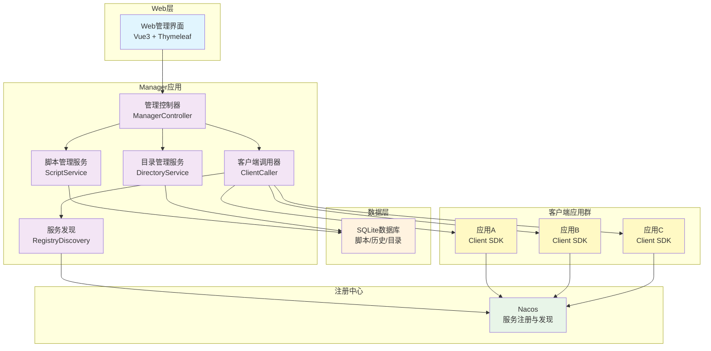
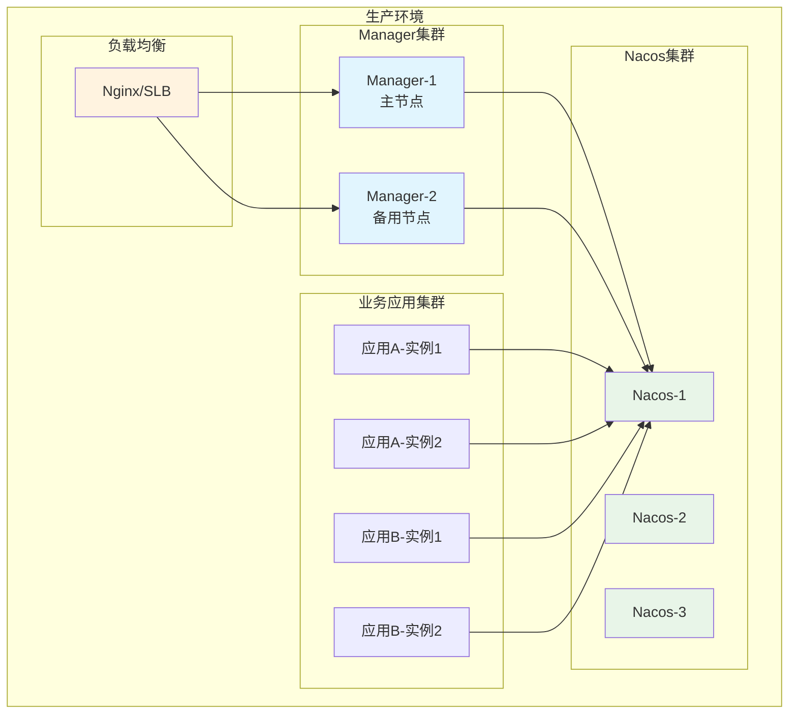

# 数据库准备

# manager启动 修改点

## 环境

manager.pom active profiles  
prod: nacos、mysql
local:  sqllite

## 配置

application-local.properties : 本地调用环境  
application-prod.properties : 生产配置

## 数据库

1. 表生成 , sqllite or mysql 等
2. 配置修改: spring.datasource.url=jdbc:sqlite:manager/src/main/resources/sqlite/maintain-manager.sqlite

## 登录态接入

cn.chenyilei.maintain.manager.controller.LoginController.getLoginInfo
cn.chenyilei.maintain.manager.context.LoginUserContext

# 客户端接入修改点

## 依赖

```
<dependency>
    <groupId>cn.chenyilei</groupId>
    <artifactId>maintain-console-client-http-starter</artifactId>
    <version>1.0-SNAPSHOT</version>
</dependency>

   <!--    上报客户端信息    -->
        <dependency>
            <groupId>cn.chenyilei</groupId>
            <artifactId>maintain-console-client-registry-starter</artifactId>
            <version>1.0-SNAPSHOT</version>
        </dependency>
```

## 配置

maintain.console.enabled=true

# Maintain Console 脚本远程调用平台

## 项目概述

Maintain Console 是一个基于Spring Boot和Spring
Cloud的分布式运维管理平台，为企业提供统一的远程脚本执行和系统维护能力。通过可视化Web界面，运维人员可以对多个分布式应用进行统一管理和脚本执行，极大提升运维效率和系统可维护性。

### 项目定位

- **分布式系统运维管理平台**：统一管理企业内多个微服务应用
- **远程脚本执行引擎**：支持Groovy脚本和通用命令的远程执行
- **可视化运维控制台**：提供直观的Web界面进行运维操作

## 技术架构

### 系统架构图



### 技术栈

- **后端框架**：Spring Boot 2.3.12, Spring Cloud Hoxton.SR12
- **数据库**：SQLite (嵌入式数据库), MYSQL
- **ORM框架**：MyBatis-Plus
- **服务发现**：Nacos Discovery
- **前端技术**：HTML, Thymeleaf
- **通信协议**：HTTP, Retrofit2
- **脚本引擎**：Groovy
- **安全机制**：RSA数字签名

### 模块设计

#### 1. Manager模块（管理端）

- **Web控制层**：提供RESTful API和页面控制
- **业务服务层**：脚本管理、目录管理、执行历史等业务逻辑
- **数据访问层**：基于MyBatis-Plus的数据持久化
- **客户端调用层**：封装对客户端应用的远程调用

#### 2. Client SDK模块（客户端）

- **Common模块**：公共API接口和DTO定义
- **Registry Starter**：服务注册集成组件
- **HTTP Starter**：HTTP通信支持组件
- **Groovy Support Starter**：Groovy脚本执行组件

#### 3. 通信机制

- **服务发现**：基于Nacos的自动服务发现
- **负载均衡**：Spring Cloud LoadBalancer
- **安全认证**：RSA签名验证机制
- **协议支持**：HTTP RESTful API

## 部署方案

### 环境要求

- **JDK版本**：1.8
- **数据库**：SQLite（内置）, MYSQL
- **注册中心**：Nacos 1.4.0+
- **内存要求**：Manager应用 512MB+，Client应用 256MB+

### 部署架构


