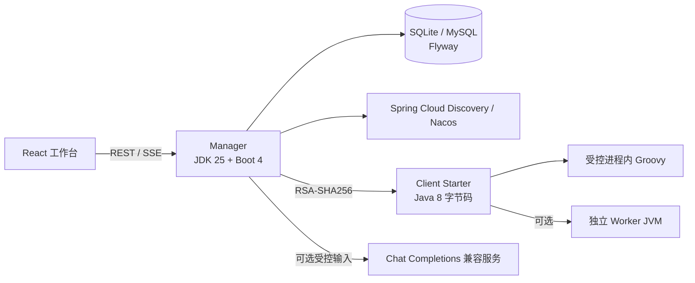

<div align="center">
  <h1>Maintain Console</h1>
  <p><strong>面向分布式应用的远程脚本运维与自动化工作台</strong></p>


</div>

## 项目定位

Maintain Console 让运维人员和研发人员在一个 Web 工作台中管理 Groovy 脚本，选择目标环境、服务和实例后执行脚本，不需要单独部署前端，也不需要为每次运维操作重新发布业务应用。

当前架构保持两个兼容边界：

- Manager 使用 JDK 25、Spring Boot 4 和官方依赖管理。
- Client Starter 继续生成 Java 8 字节码，旧业务应用可以分批升级。

## 已实现能力

- React + CodeMirror 6：Groovy 高亮、括号补全、运行时 Bean/方法补全、参数补全和风险诊断。
- 资源树、搜索、收藏、最近使用、读/编/执权限、脚本版本和恢复为新版本。
- 类型化参数 Schema：String、Number、Boolean、Enum、JSON、多行文本、日期时间、服务实例、校验与敏感值。
- 兼容原有 `$${参数名}` 占位符；敏感值在任务、历史和日志摘要中脱敏。
- 异步任务：排队、运行、取消、超时、随机/指定/全部实例、有界并发和部分成功。
- SSE 状态推送与断线轮询；Manager 重启后收敛未完成任务。
- 结构化结果：text、log、json、table、metric、line/bar/pie/area/scatter chart、file、error。
- 生产环境审批、请求内容摘要绑定、审批分离、二次确认、一次性消费和完整审计。
- RSA-SHA256 v2：keyId、timestamp、nonce、防重放和多公钥轮换；旧签名为显式迁移开关。
- 默认不暴露完整 Spring ApplicationContext，只能访问白名单 Bean。
- 可选独立 Groovy Worker JVM：独立堆、输出限制、超时强制终止且不暴露 Spring Bean。
- 可选 AI 助手：生成/解释脚本、生成 Schema、风险审查；输出只能进入未保存草稿。

## 架构


```mermaid
flowchart LR
    Browser[React 工作台] -->|REST / SSE| Manager[Manager<br/>JDK 25 + Boot 4]
    Manager --> DB[(SQLite / MySQL<br/>Flyway)]
    Manager --> Discovery[Spring Cloud Discovery / Nacos]
    Manager -->|RSA-SHA256| Client[Client Starter<br/>Java 8 字节码]
    Client --> Restricted[受控进程内 Groovy]
    Client -->|可选| Worker[独立 Worker JVM]
    Manager -->|可选受控输入| AI[Chat Completions 兼容服务]
```

执行流程：前端提交脚本与实例策略 → Manager 校验权限、参数、环境和审批 → 持久化任务并有界分发 → Client 验签与防重放 →
执行并聚合每个实例结果 → SSE 推送任务快照并持久化脱敏历史。

## 环境要求

| 范围      | 基线                                             |
|---------|------------------------------------------------|
| Manager | JDK 25、Spring Boot 4.0.7、Spring Cloud 2025.1.2 |
| Client  | Java 8 字节码                                     |
| Groovy  | 4.0.28                                         |
| Maven   | 3.8+                                           |
| 前端开发    | Node.js 22、pnpm                                |
| 数据库     | 本地 SQLite；生产 MySQL                             |

## 快速开始

前端产物已提交到 `manager/src/main/resources/static/console`，普通构建不要求 Node.js：

```bash
mvn -pl manager -am -DskipTests package
java -jar manager/target/manager-1.0-SNAPSHOT.jar --spring.profiles.active=local
```

访问 <http://localhost:9999>。本地默认数据库为：

```text
manager/src/main/resources/sqlite/maintain-manager.sqlite
```

建议把开发库放到仓库外：

```bash
MAINTAIN_SQLITE_URL=jdbc:sqlite:/absolute/path/maintain-manager.sqlite \
java -jar manager/target/manager-1.0-SNAPSHOT.jar --spring.profiles.active=local
```

### 前端开发

```bash
cd manager-web
pnpm install
pnpm test
pnpm build
```

`pnpm build` 会将带 hash 的 JS/CSS 和 `index.html` 直接输出到 Manager 静态资源目录，因此最终仍只部署一个 JAR。

### 在工作台中配置和使用参数

1. 选择环境、服务与脚本，点击 **配置参数 → 添加参数**，设置名称、类型、用途说明、默认值及校验范围。
2. 在 **编写脚本** 中使用 `def count = $${count}`。类型化参数不需要额外加引号，也可点击编辑器下方的参数引用插入。
3. 在下方 **运行配置与参数** 填写本次值，点击 **预览替换** 核对最终代码，再执行脚本。运行值不会改写默认值。
4. 点击 **保存脚本**，将脚本与参数配置一起保存。原始 Schema 保留在 **配置参数 → 高级 JSON**，与可视化配置双向同步。

新建脚本自带可直接执行的文本/数字参数与表格结果示例；旧脚本可点击 **入门示例** 预览，明确确认后才替换当前草稿，不会自动保存或执行。
先编写了占位符的脚本，可在配置页点击 **从脚本识别** 补齐定义。未声明或未使用的参数会显示具体提示。

编辑器输入时自动提供内置函数、常用片段和参数引用提示，也可点击 **代码补全** 或按 `Ctrl + Space` 手动触发；
输入 `_log.` 查看日志方法。Bean/方法提示来自所选客户端的白名单元数据，页面会显示连接状态；这不是完整的 Groovy 语言服务器。

页面通过单次请求 nonce 授权 CodeMirror 动态样式，不需要放开内联脚本或关闭 CSP。更新后需重启 Manager 并刷新页面，确保 HTML
与静态资源使用同一版本。

## Client 接入

```xml
<dependency>
    <groupId>io.github.chenyilei2016</groupId>
    <artifactId>maintain-console-client-http-starter</artifactId>
    <version>1.0-SNAPSHOT</version>
</dependency>
<dependency>
    <groupId>io.github.chenyilei2016</groupId>
    <artifactId>maintain-console-client-registry-starter</artifactId>
    <version>1.0-SNAPSHOT</version>
</dependency>
<dependency>
    <groupId>io.github.chenyilei2016</groupId>
    <artifactId>maintain-console-client-groovy-support-starter</artifactId>
    <version>1.0-SNAPSHOT</version>
</dependency>
```

推荐配置：

```properties
maintain.console.enabled=true
maintain.console.version=2
maintain.console.namespace=orders-prod
maintain.console.use-server-port-as-namespace=false

maintain.console.security.public-keys.default=${MAINTAIN_SIGN_PUBLIC_KEY}
maintain.console.security.allow-legacy-signatures=false
maintain.console.security.timestamp-tolerance-millis=300000
maintain.console.security.replay-cache-size=10000

maintain.console.groovy.expose-application-context=false
maintain.console.groovy.allowed-bean-names[0]=orderQueryService
maintain.console.groovy.max-script-length=1048576
maintain.console.groovy.allow-dangerous-scripts=false
```

`use-server-port-as-namespace=true` 是旧项目按端口路由的兼容模式。新应用建议关闭，使用稳定 namespace。

### 独立 Worker

```bash
mvn -pl maintain-console-client/maintain-console-client-groovy-worker -am -DskipTests package
```

```properties
maintain.console.groovy.execution-mode=ISOLATED_PROCESS
maintain.console.groovy.worker-jar-path=/opt/maintain/maintain-console-client-groovy-worker-1.0-SNAPSHOT.jar
maintain.console.groovy.worker-max-memory-mb=256
maintain.console.groovy.worker-timeout-seconds=180
maintain.console.groovy.worker-max-result-bytes=2097152
```

Worker 模式不会暴露 Spring Bean，适合纯计算与结构化结果脚本。独立 JVM
解决“可终止”和堆上限，但不是完整沙箱；生产仍应使用非特权用户、只读文件系统、最小挂载、NetworkPolicy、CPU/内存/PID 限额。JDK 25
下不要依赖 SecurityManager。

## Manager 生产配置

```properties
maintain.manager.security.key-id=default
maintain.manager.security.private-key=${MAINTAIN_SIGN_PRIVATE_KEY}
maintain.manager.security.identity-shared-secret=${MAINTAIN_IDENTITY_SHARED_SECRET}
maintain.manager.security.allow-legacy-clients=false
maintain.manager.security.allow-legacy-synchronous-execution=false
```

- 私钥是 Base64 编码的 PKCS#8 RSA 私钥。
- 身份共享密钥至少 32 个字符，由可信网关为用户身份头做 HMAC-SHA256 签名。
- 生产流量应启用 TLS；需要更强工作负载身份时再叠加 mTLS。
- 轮换时先向 Client 增加新公钥，再切换 Manager keyId，最后移除旧公钥。

目标环境不再写死在 Controller：

```properties
maintain.manager.target-environments[0].value=prod-cn
maintain.manager.target-environments[0].name=生产华东
maintain.manager.target-environments[0].cluster=cluster-a
maintain.manager.target-environments[0].namespace=orders-prod
maintain.manager.target-environments[0].production=true
maintain.manager.target-environments[0].all-namespaces=false
```

前端继续传旧字段 `env` 保持兼容，但服务端从正式环境目录解析 namespace 和生产属性。生产属性决定视觉警告、审批与二次确认。

## 参数协议

```json
{
  "version": 1,
  "parameters": [
    {"name": "orderId", "type": "STRING", "required": true, "pattern": "^[A-Za-z0-9_-]{1,64}$"},
    {"name": "limit", "type": "NUMBER", "defaultValue": 100, "min": 1, "max": 1000},
    {"name": "token", "type": "STRING", "required": true, "sensitive": true}
  ]
}
```

旧脚本可继续只写 `$${name}`；存在 Schema 时，占位符集合必须完全一致。

## 结构化结果

```groovy
return result(
    resultMetric('执行指标', [success: 12, failed: 1]),
    resultTable('失败明细', ['orderId', 'reason'], [
        ['A-100', '状态不允许'],
        ['A-101', '库存不足']
    ]),
    resultChart('处理趋势', 'line', ['10:00', '10:05', '10:10'], [
        [name: '成功数', data: [2, 5, 12]]
    ])
)
```

小文件可直接下载，解码后上限 1 MiB：

```groovy
return result(resultFileContent(
    '导出结果', 'report.csv',
    'orderId,status\nA-100,SUCCESS'.getBytes('UTF-8'),
    'text/csv'
))
```

表格最多 1000 行，图表每组最多 1000 个点，完整协议最多 2 MiB。未知 block 会安全降级，不渲染任意 HTML，也不执行脚本返回的前端代码。普通字符串和普通
JSON 仍分别兼容为 text/json。

## AI 助手

AI 默认关闭。配置 Chat Completions 兼容端点：

```properties
maintain.manager.ai.enabled=true
maintain.manager.ai.endpoint=https://ai.example.com/v1/chat/completions
maintain.manager.ai.api-key=${MAINTAIN_AI_API_KEY}
maintain.manager.ai.model=your-model-name
```

仅发送当前脚本、参数 Schema、服务名和用户说明；不发送运行参数、执行结果和历史日志。常见密钥字面量先脱敏。模型输出只修改未保存草稿，保存、执行、审批和审计仍走原流程；模型不可用不影响核心链路。

## 安全边界

| 边界               | 当前措施                                         |
|------------------|----------------------------------------------|
| 用户身份             | 非本地环境要求可信身份头 HMAC-SHA256、timestamp、nonce、防重放 |
| 脚本资源             | 读、编辑、执行独立权限                                  |
| 生产执行             | 内容摘要绑定审批、申请审批分离、过期、一次性消费、二次确认                |
| Manager → Client | RSA-SHA256 v2、keyId、多公钥、timestamp、nonce、防重放  |
| Groovy           | 白名单 Bean、风险拒绝；可选独立 Worker 强制终止               |
| 展示               | React 转义、拒绝 HTML block、受限文件结果                |
| 留痕               | 资源、执行、取消、审批和 AI 操作持久化审计                      |

`allow-dangerous-scripts`、`expose-application-context`、旧签名和旧同步执行接口都是迁移开关，不应作为生产默认配置。

## 数据迁移

Flyway 同时维护 SQLite 与 MySQL：

| 版本 | 内容                   |
|----|----------------------|
| V1 | 目录、脚本和执行历史基线         |
| V2 | 参数 Schema、结构化结果、脚本版本 |
| V3 | 异步执行任务               |
| V4 | 生产审批与审计              |
| V5 | 收藏与最近使用              |

升级顺序：备份数据库 → 在副本验证 Flyway → Manager 临时开启旧 Client 兼容 → Client 升级协议 v2 与公钥 →
观察签名/任务/审计 → 关闭旧签名和旧同步执行。回滚 Manager 时不要回退数据库版本；旧字段与 `$${name}` 协议仍保留。

## 构建验证

```bash
mvn -DfailIfNoTests=false test

cd manager-web
pnpm test
pnpm build
```

## 模块

```text
manager/                                      # JDK 25 / Boot 4 管理端与嵌入前端
manager-web/                                  # React + Vite + CodeMirror 6
maintain-console-client/
├── maintain-console-client-common/           # Java 8 公共协议与签名
├── maintain-console-client-http-starter/     # HTTP 入口与验签
├── maintain-console-client-registry-starter/ # 注册元数据
├── maintain-console-client-groovy-support-starter/ # Groovy 与受控上下文
└── maintain-console-client-groovy-worker/    # 独立 Worker JVM
groovy-sample/
sample-projects/
```

## 当前边界

- SSE 推送持久化任务快照和心跳，不是逐行远程日志流。
- nonce 防重放缓存位于单进程；水平扩容需要共享短期存储。
- Worker 不访问业务 Bean；隔离执行若需业务能力，应提供最小权限 RPC，不能重新暴露 ApplicationContext。
- 内联文件适合 1 MiB 内结果；大文件应使用对象存储和短期签名 URL。

## License

[Apache License 2.0](LICENSE)
