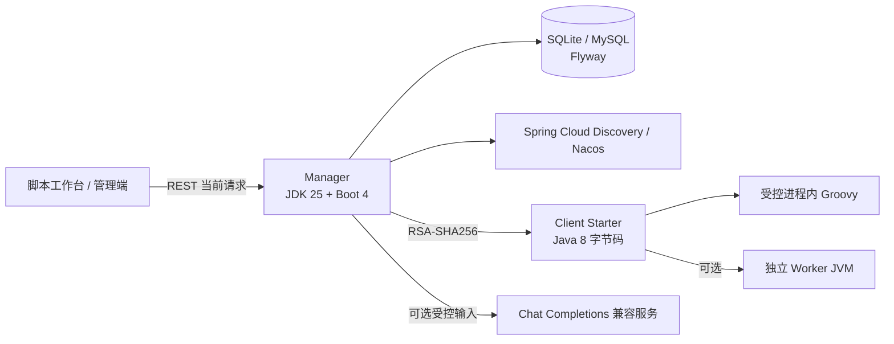

<div align="center">
  <h1>Maintain Console</h1>
  <p><strong>面向分布式应用的远程脚本运维与自动化工作台</strong></p>


</div>

## 项目定位

开发者将应用已开放的业务能力封装成 Groovy 脚本，配置表单、用途与 JSON 权限后在同一个工作台协作或运行。运营用户只看到获准的内容和操作，不需要理解代码。
前端编译进 Manager resources，最终只部署一个 JAR；制作新脚本不需要重新发布业务应用。

当前架构保持两个兼容边界：

- Manager 使用 JDK 25、Spring Boot 4 和官方依赖管理。
- Client Starter 继续生成 Java 8 字节码，旧业务应用可以分批升级。

## 已实现能力

- React + CodeMirror 6：Groovy 高亮、括号补全、运行时 Bean/方法补全、参数补全和风险诊断。
- 独立 `/workspace` 脚本工作台与 `/admin` 管理端；不再混用管理、开发和运行入口。
- 全员可见脚本目录；源码、编辑、运行和授权管理完全由脚本 JSON v3 分别控制。
- 工作台直接入口、最多 5 个脚本编辑会话、应用内资源切换和默认可见的结果区域。
- 独立用户名密码登录、BCrypt 凭证、首管理员启动引导、账号停用/密码重置、运行概览与环境视图。
- 类型化参数 Schema：String、Number、Boolean、Enum、JSON、多行文本、日期时间、服务实例、校验与敏感值。
- 中文显示名、分组与高级参数、字段校验、默认值和按用户/工具/环境隔离的个人预设。
- 当前 HTTP 请求执行：随机/指定实例，工具显式允许时可有界执行全部实例；区分成功、失败、部分成功、未开始与结果未知。
- 保存/运行起始版本校验、版本内容对比、恢复为新版本、标签页草稿恢复与离开保护。
- 结构化结果：text、log、json、table、metric、line/bar/pie/area/scatter chart、file、error。
- 当前结果内筛选、排序、分页、安全 CSV 导出；执行历史与审计。无任务中心、任务轮询、SSE 或审批依赖。
- 生产/操作类风险确认、目标范围校验。确认和“查询类”标记都不是安全隔离或只读证明。
- RSA-SHA256 v2：keyId、timestamp、nonce、防重放和多公钥轮换；旧签名为显式迁移开关。
- 默认不暴露完整 Spring ApplicationContext，只能访问白名单 Bean。
- 可选独立 Groovy Worker JVM：独立堆、输出限制、超时强制终止且不暴露 Spring Bean。
- 可选 AI 助手：生成/解释脚本、生成 Schema、风险审查；输出只能进入未保存草稿。

## 架构


```mermaid
flowchart LR
    Browser[脚本工作台 / 管理端] -->|REST 当前请求| Manager[Manager<br/>JDK 25 + Boot 4]
    Manager --> DB[(SQLite / MySQL<br/>Flyway)]
    Manager --> Discovery[Spring Cloud Discovery / Nacos]
    Manager -->|RSA-SHA256| Client[Client Starter<br/>Java 8 字节码]
    Client --> Restricted[受控进程内 Groovy]
    Client -->|可选| Worker[独立 Worker JVM]
    Manager -->|可选受控输入| AI[Chat Completions 兼容服务]
```

执行流程：可信身份与权限 → 固定保存版本或调试草稿 → 校验类型化参数、环境、目标和风险确认 → Client 验签与防重放 →
有界调用并汇总 → 保存记录、返回结果。
调用不自动重试，不自动换实例；超时或断网只说明未得到确定结果，不能证明远端停止或操作未发生。

## 环境要求

| 范围      | 基线                                             |
|---------|------------------------------------------------|
| Manager | JDK 25、Spring Boot 4.0.7、Spring Cloud 2025.1.2 |
| Client  | Java 8 字节码                                     |
| Groovy  | 4.0.28                                         |
| Maven   | 3.8+                                           |
| 前端开发    | Node.js 22、pnpm                                |
| 数据库     | 本地 SQLite；生产 MySQL                             |

## 快速开始

前端产物已提交到 `manager/src/main/resources/static/console`，普通构建不要求 Node.js：

```bash
mvn -pl manager -am -DskipTests clean package
MAINTAIN_ADMIN_INITIAL_PASSWORD='replace-with-at-least-12-chars' \
java -jar manager/target/manager-1.0-SNAPSHOT.jar --spring.profiles.active=local
```

访问 <http://localhost:9999>。本地默认数据库为：

```text
manager/src/main/resources/sqlite/maintain-manager.sqlite
```

建议把开发库放到仓库外：

```bash
MAINTAIN_SQLITE_URL=jdbc:sqlite:/absolute/path/maintain-manager.sqlite \
java -jar manager/target/manager-1.0-SNAPSHOT.jar --spring.profiles.active=local
```

首次使用一个全新数据库时，必须通过 `MAINTAIN_ADMIN_INITIAL_PASSWORD` 提供初始管理员密码；已有可登录管理员后不再使用该值。

`local` / `demo` 还提供 **生产环境（SQLite 模拟）**。它只用于验证生产标识、风险确认和权限流程：
执行目标仍是当前 Manager 进程，业务数据仍写入上述 SQLite，不会连接真实生产注册中心或生产数据库。
脚本必须在 **授权 → 允许环境** 中显式勾选该环境后才可运行；工作台会显示尚未授权的环境，不会静默隐藏。

### 前端开发

```bash
cd manager-web
pnpm install
pnpm test
pnpm build
```

`pnpm build` 会将带 hash 的 JS/CSS、工作台 `index.html` 和管理端 `admin.html` 直接输出到 Manager 静态资源目录，因此最终仍只部署一个
JAR。

### 开发者制作工具

1. 登录后进入 `/workspace`，从最近编辑或资源列表直接打开脚本；也可 **新建脚本**
   ，选择服务、环境和模板。所有启用账号都能创建自己的脚本；新脚本默认只把创建者写入读、编、执、管四项 JSON 权限。
2. 右侧 **参数配置 → 添加参数**：设置技术名称、中文显示名、用途/示例、类型、默认值、分组及校验范围。
3. 左侧使用 `def count = $${count}`。类型化参数是独立的数据表达式，不要额外加引号，也不要放入注释、字符串或标识符内部。
4. **用途与风险** 填写说明、输入示例和操作类型；**运行填值** 填写本次值，点击 **调试当前内容**。草稿调试同时要求编辑与执行权限，不自动保存。
5. **保存脚本** 更新共享工具的当前版本；起始版本冲突会拒绝覆盖。**版本历史** 可并排比较代码/参数定义，恢复会创建新版本，但不恢复旧授权、不撤销业务操作。
6. **授权与分享** 添加员工 ID，选择仅运行/查看与运行/协作开发，配置允许环境与全部实例策略，再复制链接。

### 同事通过分享使用

1. 登录后从 `/workspace` 目录打开脚本，或直接访问 `/workspace/{scriptId}`。旧 `/tools/{scriptId}`
   只做兼容跳转；链接本身不授予权限、不携带参数，也不会自动执行。
2. 查看用途和风险，选择允许的环境/目标，填写参数。页面不返回或显示源码、完整授权和敏感默认值。
3. 点击 **运行工具**。服务器只接受脚本 ID、已看版本、参数值与目标，代码/Schema/服务均由保存版本决定。版本变化需要刷新后重新核对。
4. 在结果中查看表格、JSON、日志等；表格筛选/排序/分页/导出仅针对当前返回数据，截断结果不代表完整查询数据。
5. **执行历史** 默认只看自己的记录；脚本 JSON 中具备 MANAGE 的用户可查看该脚本全部记录。回填参数不执行，敏感值不回填。

预设保存在本浏览器，按用户、工具、环境隔离，最多 5 组；敏感参数不保存。开发草稿使用当前标签页 `sessionStorage`
，不缓存运行值，剔除敏感默认值/示例；代码中硬编码的密钥不应作为草稿使用。

工作台采用左侧编辑器、右侧参数、底部结果的布局。右侧切换 **运行填值 / 参数配置**，执行按钮始终位于侧栏底部；结果默认展开，也可收起、聚焦及还原。
资源树切换使用应用内导航；最多保留 5 个脚本编辑会话，每个会话独立保留草稿、编辑器撤销、参数、目标、运行状态和本次结果。
资源栏可折叠，窄屏时参数通过 **参数与运行** 按钮打开抽屉；各区域独立滚动，切换布局不会重建编辑器。
收藏、版本、权限、示例等操作直接展示在工具栏中；执行目标摘要固定在参数列表上方，点击 **目标设置** 修改并应用。
参数区会根据实际溢出显示 **下方还有内容 / 上方还有内容 / 已到末尾**，点击下方提示可继续向下查看。

`App` 只负责身份加载和页面入口，页面、请求、状态与样式归属业务模块：

| 模块                          | 职责                            |
|-----------------------------|-------------------------------|
| `manager-web/src/tools`     | 授权分享与仅运行用户所需的最小工具 API         |
| `manager-web/src/workspace` | 编辑草稿、版本冲突/恢复、资源操作、目标配置与工作区布局  |
| `manager-web/src/execution` | 当前请求状态、结果/未知态、历史查阅与参数回填       |
| `manager-web/src/results`   | 当前表格筛选/排序/分页、CSV 转义及公式注入防护    |
| 共享组件                        | CodeMirror、类型化参数表单、结构化结果、基础弹窗 |

后端 `execution.ScriptExecutionService` 暴露 `runSaved / debugDraft` 两个清楚的入口，内部共用一次性执行核心；
`ScriptAccessControl` 负责资源授权，`tools` 负责目录/最小运行表单/授权，历史独立于执行调度。没有引入通用工厂、发布平台或新前端依赖。

新建脚本自带可直接执行的文本/数字参数与表格结果示例；旧脚本可点击 **入门示例** 预览，明确确认后才替换当前草稿，不会自动保存或执行。
先编写占位符的脚本可 **从脚本识别**；无 Schema 的旧脚本需在 **配置为类型化工具** 中查看候选配置并由作者确认，再人工调整引用位置。不会批量正则改写代码。

编辑器输入时自动提供内置函数、常用片段和参数引用提示，也可点击 **代码补全** 或按 `Ctrl + Space` 手动触发；
输入 `_log.` 查看日志方法。Bean/方法提示来自所选客户端的白名单元数据，页面会显示连接状态；这不是完整的 Groovy 语言服务器。

页面通过单次请求 nonce 授权 CodeMirror 动态样式，不需要放开内联脚本或关闭 CSP。更新后需重启 Manager 并刷新页面，确保 HTML
与静态资源使用同一版本。

## Client 接入

```xml
<dependency>
    <groupId>io.github.chenyilei2016</groupId>
    <artifactId>maintain-console-client-http-starter</artifactId>
    <version>1.0-SNAPSHOT</version>
</dependency>
<dependency>
    <groupId>io.github.chenyilei2016</groupId>
    <artifactId>maintain-console-client-registry-starter</artifactId>
    <version>1.0-SNAPSHOT</version>
</dependency>
<dependency>
    <groupId>io.github.chenyilei2016</groupId>
    <artifactId>maintain-console-client-groovy-support-starter</artifactId>
    <version>1.0-SNAPSHOT</version>
</dependency>
```

推荐配置：

```properties
maintain.console.enabled=true
maintain.console.version=2
maintain.console.namespace=orders-prod
maintain.console.use-server-port-as-namespace=false

maintain.console.security.public-keys.default=${MAINTAIN_SIGN_PUBLIC_KEY}
maintain.console.security.allow-legacy-signatures=false
maintain.console.security.timestamp-tolerance-millis=300000
maintain.console.security.replay-cache-size=10000

maintain.console.groovy.expose-application-context=false
maintain.console.groovy.allowed-bean-names[0]=orderQueryService
maintain.console.groovy.max-script-length=1048576
maintain.console.groovy.allow-dangerous-scripts=false
```

`use-server-port-as-namespace=true` 是旧项目按端口路由的兼容模式。新应用建议关闭，使用稳定 namespace。

### 独立 Worker

```bash
mvn -pl maintain-console-client/maintain-console-client-groovy-worker -am -DskipTests package
```

```properties
maintain.console.groovy.execution-mode=ISOLATED_PROCESS
maintain.console.groovy.worker-jar-path=/opt/maintain/maintain-console-client-groovy-worker-1.0-SNAPSHOT.jar
maintain.console.groovy.worker-max-memory-mb=256
maintain.console.groovy.worker-timeout-seconds=180
maintain.console.groovy.worker-max-result-bytes=2097152
```

Worker 模式不会暴露 Spring Bean，适合纯计算与结构化结果脚本。独立 JVM
解决“可终止”和堆上限，但不是完整沙箱；生产仍应使用非特权用户、只读文件系统、最小挂载、NetworkPolicy、CPU/内存/PID 限额。JDK 25
下不要依赖 SecurityManager。

## 登录、用户与会话

默认 `LOCAL_PASSWORD` 模式使用独立用户名密码。系统用户与本地凭证分表；密码使用 BCrypt 哈希，页面和接口均不返回密码或哈希。
全新数据库没有可登录管理员时，启动器使用 `MAINTAIN_ADMIN_INITIAL_USERNAME`、`MAINTAIN_ADMIN_INITIAL_DISPLAY_NAME`
和必须显式提供的 `MAINTAIN_ADMIN_INITIAL_PASSWORD` 创建第一个管理员；不存在公开的“首访注册管理员”接口。

管理员在 `/admin` 创建账号、停用账号、分配 `ADMIN` 和重置密码。`ADMIN` 只控制管理端功能，不会隐式获得任何脚本能力。
每个受保护请求都会重新读取用户状态，因此账号停用后已有会话立即失效。管理员状态变更会在数据库事务内串行校验，系统始终保留至少一个可登录管理员；
账号创建、状态/角色修改和密码重置写入审计日志，日志不记录密码。登录受 CSRF 保护，会话 Cookie 为 HttpOnly、SameSite=Lax；生产默认要求
Secure。

本地密码登录在 BCrypt 校验前按账号和来源地址做有界保护：账号连续失败 10 次后保护 10 分钟，同一来源 5 分钟最多尝试 100
次，错误统一返回“账号或密码错误”。
该计数是单进程内存状态；多实例部署应在网关增加共享限流，不能把进程内计数当作全局防护。

需要由公司网关提供身份时，可显式设置 `maintain.manager.identity.mode=TRUSTED_HEADERS` 并配置签名共享密钥；它不是本地密码失败后的降级路径。
未来接入公司登录 SDK 时，应在认证来源处验证凭证后关联本地用户，不能因为本地存在记录就跳过 SDK 校验。

用户表保留 `employeeNo` 作为现有脚本 ACL 的稳定主体标识，内部用户 ID 只用于会话与用户管理。系统角色管理平台能力，不能替代每个脚本的读、编、执授权。
管理中心的运行概览直接聚合执行历史，提供 7/30/90 天时间窗和 Top 10 工具，不维护第二份统计数据，也不会无界读取历史记录。

## Manager 生产配置

```properties
maintain.manager.security.key-id=default
maintain.manager.security.private-key=${MAINTAIN_SIGN_PRIVATE_KEY}
maintain.manager.security.allow-legacy-clients=false
maintain.manager.identity.mode=LOCAL_PASSWORD
maintain.manager.bootstrap-admin.password=${MAINTAIN_ADMIN_INITIAL_PASSWORD}

maintain.manager.execution.target-core-pool-size=4
maintain.manager.execution.target-max-pool-size=8
maintain.manager.execution.target-queue-capacity=100
maintain.manager.execution.max-targets=20
maintain.manager.execution.max-timeout-seconds=900
```

- 私钥是 Base64 编码的 PKCS#8 RSA 私钥。
- 只有选择 `TRUSTED_HEADERS` 时才需要身份共享密钥；可信网关必须用至少 32 字符的密钥为身份头做 HMAC-SHA256 签名。
- 生产流量应启用 TLS；需要更强工作负载身份时再叠加 mTLS。
- 轮换时先向 Client 增加新公钥，再切换 Manager keyId，最后移除旧公钥。
- `local` 使用本进程发现与执行器，只用于开发；其中的 SQLite 模拟生产目标不会连接真实生产环境。
- 外层网关需保留 `/admin`、`/workspace/{id}` 的登录后返回地址；旧 `/tools/{id}` 只兼容重定向。真实公司登录 SDK 尚未接入。

目标环境不再写死在 Controller：

```properties
maintain.manager.target-environments[0].value=prod-cn
maintain.manager.target-environments[0].name=生产华东
maintain.manager.target-environments[0].cluster=cluster-a
maintain.manager.target-environments[0].namespace=orders-prod
maintain.manager.target-environments[0].production=true
maintain.manager.target-environments[0].all-namespaces=false
```

新入口使用 `target.environment`；旧兼容入口仍接收 `env`。服务器从环境目录解析 namespace 和生产属性，再校验工具的允许范围。
全部实例需要工具显式允许，默认随机单实例。等待秒数默认 180，最大值受服务端配置约束；外层代理超时应匹配，否则页面可能提前报告结果未知。

### 多 Nacos

默认 `SPRING_CLOUD` 模式保持原单注册中心行为。多个独立 Nacos 使用 `MULTI_NACOS`，每个环境明确绑定连接、namespaceId、group
和实例 cluster：

```properties
maintain.manager.discovery.mode=MULTI_NACOS
maintain.manager.discovery.max-services=500
maintain.manager.discovery.nacos-connections[0].id=test-registry
maintain.manager.discovery.nacos-connections[0].name=测试注册中心
maintain.manager.discovery.nacos-connections[0].server-addr=${TEST_NACOS_ADDR}
maintain.manager.discovery.nacos-connections[0].namespace-id=${TEST_NACOS_NAMESPACE_ID}
maintain.manager.discovery.nacos-connections[0].default-group=DEFAULT_GROUP
maintain.manager.discovery.nacos-connections[1].id=prod-registry
maintain.manager.discovery.nacos-connections[1].name=生产注册中心
maintain.manager.discovery.nacos-connections[1].server-addr=${PROD_NACOS_ADDR}
maintain.manager.discovery.nacos-connections[1].namespace-id=${PROD_NACOS_NAMESPACE_ID}
maintain.manager.discovery.nacos-connections[1].username=${PROD_NACOS_USERNAME}
maintain.manager.discovery.nacos-connections[1].password=${PROD_NACOS_PASSWORD}
maintain.manager.target-environments[0].value=test
maintain.manager.target-environments[0].name=测试环境
maintain.manager.target-environments[0].registry-id=test-registry
maintain.manager.target-environments[0].group-name=DEFAULT_GROUP
maintain.manager.target-environments[1].value=prod
maintain.manager.target-environments[1].name=生产环境
maintain.manager.target-environments[1].registry-id=prod-registry
maintain.manager.target-environments[1].group-name=DEFAULT_GROUP
maintain.manager.target-environments[1].instance-clusters[0]=prod-cluster
maintain.manager.target-environments[1].production=true
```

每个连接持有独立且受控关闭的 Nacos Client；不会把测试/生产地址拼入一个 `serverAddr`，不会在目标连接失败后自动切换其他环境。同名实例
ID 会增加 `registryId` 前缀，缓存和执行记录继续使用明确环境。
连接密码不会从管理接口返回。管理页当前展示脱敏配置状态；真实 Nacos 连通、实例发现和远端 Client 协议兼容仍是三个不同的验收层次。
`MULTI_NACOS` 部署建议关闭 Spring Cloud Nacos 自动服务发现，避免额外维护一条不用于目标调用的默认发现连接。

### 权限与旧接口兼容

新脚本的权限配置为 v3：READ、EDIT、INVOKE、MANAGE 都来自 JSON 显式名单，系统管理员和旧全局白名单都不能旁路。
创建时服务端把创建者写入四项能力；MANAGE 不隐含 EDIT，EDIT 也不隐含 INVOKE。未声明版本的旧 ACL 按 v1/v2 收敛兼容，不批量改写。
通过授权面板保存旧 ACL 会明确确认升级为 v3；保存内容和恢复版本都不会改变权限 JSON。旧 ACL 未指定环境时只保留既有兼容边界，分享运行前必须指定允许环境。

| 接口                                     | 行为                                          |
|----------------------------------------|---------------------------------------------|
| `POST /manager/tools/run`              | 已保存工具运行：INVOKE，必传已看 `version`，必须有类型化 Schema |
| `POST /manager/scripts/debug`          | 草稿调试：EDIT + INVOKE，必传起始 `version`，不自动保存     |
| `POST /manager/script/eval`、`/eval/v2` | 兼容字段入口，统一进入草稿调试校验；不再有 local 绕过              |
| `POST /devops/manager/script/eval`     | 统一进入保存工具运行，旧调用方需增加 `version`；不会代填最新版本       |
| 旧任务/审批接口                               | 已移除，不创建任务、不订阅、不轮询、不恢复                       |

权限撤销后新请求立即拒绝；已发出的调用、已显示的结果无法通过撤销权限收回。

## 参数协议

```json
{
  "version": 1,
  "parameters": [
    {"name": "orderId", "label": "订单编号", "group": "查询条件", "type": "STRING", "required": true, "pattern": "^[A-Za-z0-9_-]{1,64}$"},
    {"name": "limit", "type": "NUMBER", "defaultValue": 100, "min": 1, "max": 1000},
    {"name": "token", "type": "STRING", "required": true, "sensitive": true}
  ]
}
```

存在 Schema 时，占位符集合必须完全一致；字符串、JSON、数字、布尔按数据类型处理，未知参数被拒绝。
`return '$${name}'` 这样的旧写法不能作为类型化工具分享，需改为 `return $${name}`。无 Schema 的原样替换仅用于有编辑+执行权限的开发兼容。

业务数据权限使用服务器注入的 `_caller.employeeNo`，不能信任表单中的 employeeNo/tenantId 等字段作为授权来源。
类型化参数不能代替 SQL 参数化或业务数据范围校验。敏感值会对结果和过程日志中的匹配值进行脱敏，这不是通用污点追踪，也不会追溯改写旧历史数据。

## 结构化结果

```groovy
return result(
    resultMetric('执行指标', [success: 12, failed: 1]),
    resultTable('失败明细', ['orderId', 'reason'], [
        ['A-100', '状态不允许'],
        ['A-101', '库存不足']
    ]),
    resultChart('处理趋势', 'line', ['10:00', '10:05', '10:10'], [
        [name: '成功数', data: [2, 5, 12]]
    ])
)
```

小文件可直接下载，解码后上限 1 MiB：

```groovy
return result(resultFileContent(
    '导出结果', 'report.csv',
    'orderId,status\nA-100,SUCCESS'.getBytes('UTF-8'),
    'text/csv'
))
```

表格最多 1000 行，图表每组最多 1000 个点，完整协议最多 2 MiB。未知 block 会安全降级，不渲染任意 HTML，也不执行脚本返回的前端代码。普通字符串和普通
JSON 仍分别兼容为 text/json。

`_log.info/warn/error/debug/trace` 和 `println` 随当前结果返回，单次过程日志限制 16K 字符，不是实时流，也不等于业务 Bean
的所有日志。

## AI 助手

AI 是可选能力，启用情况以当前配置为准。不使用时显式设置 `MAINTAIN_AI_ENABLED=false`；需要时配置 Chat Completions 兼容端点：

```properties
maintain.manager.ai.enabled=true
maintain.manager.ai.endpoint=https://ai.example.com/v1/chat/completions
maintain.manager.ai.api-key=${MAINTAIN_AI_API_KEY}
maintain.manager.ai.model=your-model-name
```

仅发送当前脚本、参数 Schema、服务名和用户说明；不发送运行参数、执行结果和历史日志。常见密钥字面量先脱敏。模型输出只修改未保存草稿，保存、执行和审计仍走明确操作流程；模型不可用不影响核心链路。

## 安全边界

| 边界               | 当前措施                                        |
|------------------|---------------------------------------------|
| 用户身份             | 默认独立密码哈希与服务端会话；可信身份头模式需显式启用和验签              |
| 脚本资源             | 查看、编辑、执行、授权管理四项 JSON 权限独立判断                 |
| 生产执行             | 工具环境/目标授权、操作风险提示、二次确认；无审批流程                 |
| Manager → Client | RSA-SHA256 v2、keyId、多公钥、timestamp、nonce、防重放 |
| Groovy           | 白名单 Bean、风险拒绝；可选独立 Worker 强制终止              |
| 展示               | React 转义、拒绝 HTML block、受限文件结果               |
| 留痕               | 资源、授权、执行、版本与 AI 操作审计；历史按资源与执行者过滤            |

`allow-dangerous-scripts`、`expose-application-context` 和旧签名兼容开关不应作为生产默认配置。执行超时、按钮防重复点击不提供业务幂等保证。

## 数据迁移

Flyway 同时维护 SQLite 与 MySQL：

| 版本 | 内容                         |
|----|----------------------------|
| V1 | 目录、脚本和执行历史基线               |
| V2 | 参数 Schema、结构化结果、脚本版本       |
| V3 | 异步执行任务                     |
| V4 | 生产审批与审计                    |
| V5 | 收藏与最近使用                    |
| V6 | 工具说明元数据、历史环境/版本/实例/结果状态及索引 |
| V7 | 本地系统用户、认证来源、状态、角色与登录时间     |
| V8 | 独立用户名与 BCrypt 密码凭证         |

升级顺序：备份数据库 → 在副本验证 Flyway V6–V8 → 配置首管理员密码并升级 Manager/Client →
作者核对旧工具类型化参数与环境授权 →
升级仍使用旧执行接口的调用方。
V1–V5 不修改；旧任务、审批、脚本和执行历史表均保留，不做数据清空或 ACL 批量改写。旧后台任务不会在新 Manager 中恢复，旧审批不再参与运行。
生产 MySQL 上线前需在真实副本验证迁移；本次已执行的升级回归使用独立 SQLite，不代表 MySQL 已完成运行验证。

## 构建验证

```bash
mvn -pl manager -am -DfailIfNoTests=false -Dsurefire.failIfNoSpecifiedTests=false test

cd manager-web
pnpm test
pnpm build
```

## 模块

```text
manager/                                      # JDK 25 / Boot 4 管理端与嵌入前端
manager-web/                                  # React + Vite + CodeMirror 6
maintain-console-client/
├── maintain-console-client-common/           # Java 8 公共协议与签名
├── maintain-console-client-http-starter/     # HTTP 入口与验签
├── maintain-console-client-registry-starter/ # 注册元数据
├── maintain-console-client-groovy-support-starter/ # Groovy 与受控上下文
└── maintain-console-client-groovy-worker/    # 独立 Worker JVM
groovy-sample/
sample-projects/
```

## 当前边界

- 没有后台续跑、轮询、恢复、自动重试或取消承诺；长任务应交给已有专用作业系统。
- 工作台资源树上限 500 个节点；达到该规模时应增加服务端树分页，而不是继续全量加载。
- 版本比较采用代码/参数定义并排查看，不建设分支、发布或自动合并。
- 公司登录 SDK、生产多实例会话存储和真实 Nacos 联调仍需在对应部署环境完成；当前可信身份头模式只提供明确的兼容入口。
- 日志只随成功返回的结果收集；进程崩溃/网络中断时无法保证拿到完整远端日志。已发出操作的业务结果需要人工核对。
- nonce 防重放缓存位于单进程；水平扩容需要共享短期存储。
- Worker 不访问业务 Bean；隔离执行若需业务能力，应提供最小权限 RPC，不能重新暴露 ApplicationContext。
- 内联文件适合 1 MiB 内结果；大文件应使用对象存储和短期签名 URL。

本次设计取舍、退出代码清单与验收记录见 [工具台重构实施记录](docs/tool-console-refactor.md)。

## License

[Apache License 2.0](LICENSE)
